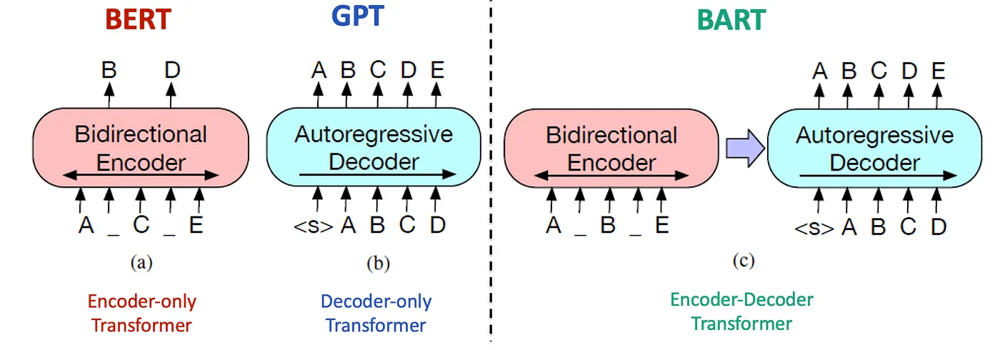
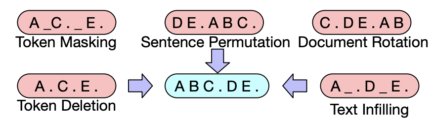
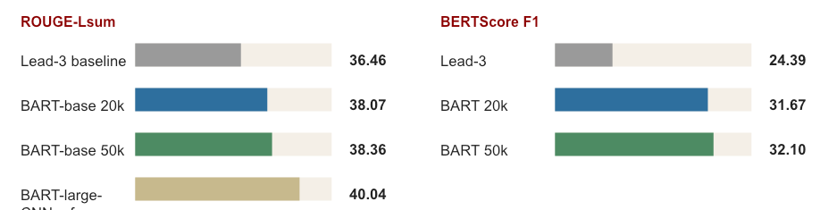
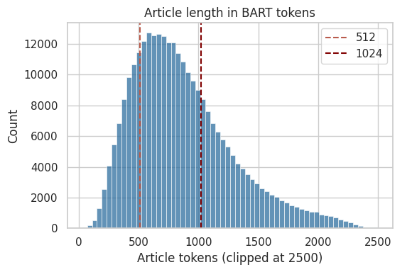
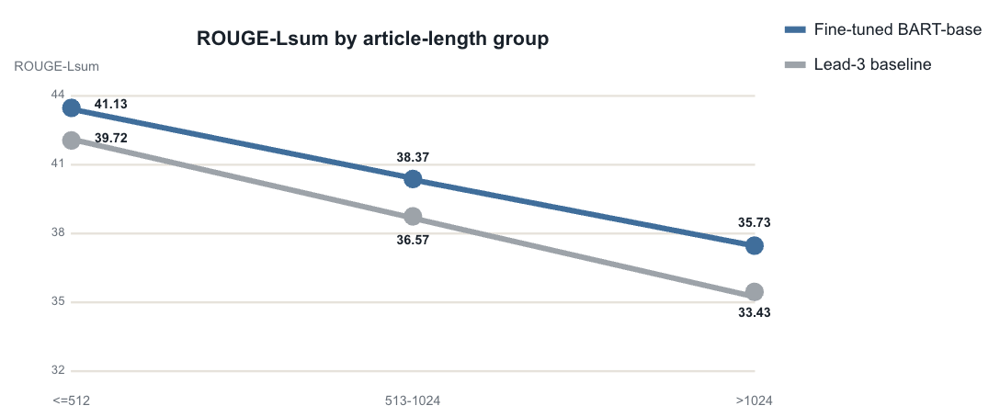
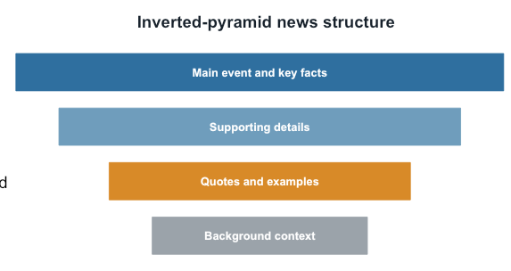
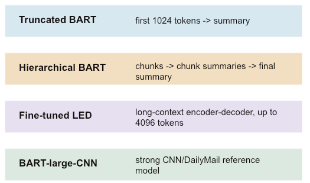
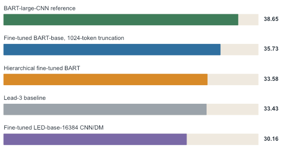
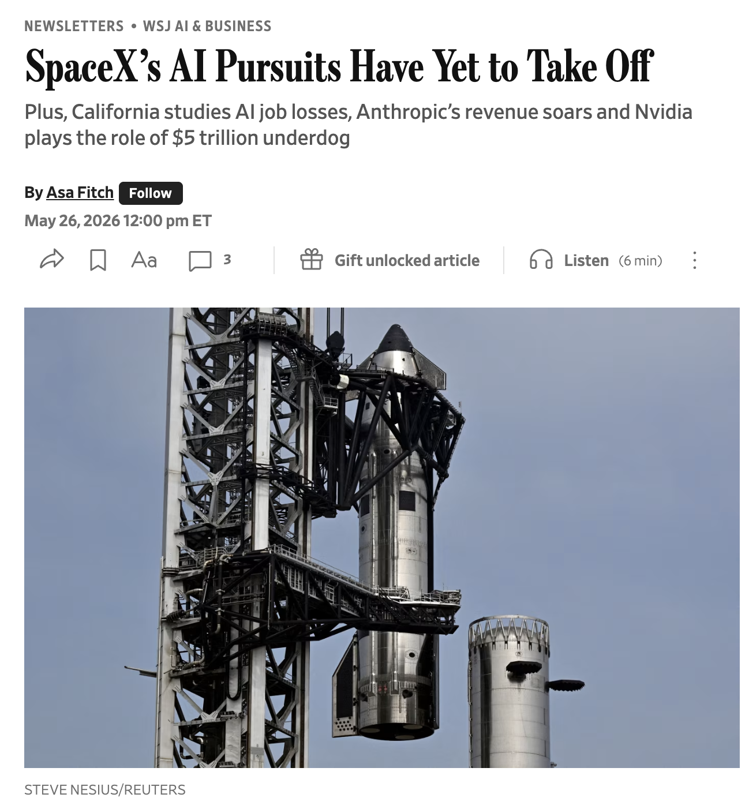

# ML2 Final Project: Abstractive News Summarization

## Abstractive News Summarization with Transformer Models

**Presenters:** Yihong Li, Tony Li

## Problem & Dataset

Task: generate concise abstractive summaries for long-form news articles.

| Component | Description |
| --- | --- |
| Input dataset | CNN/DailyMail news article, long English text |
| Model | Sequence-to-sequence Transformer summarizer |
| Target | Human-written highlights used as reference summaries |

| Dataset field | Role | Description |
| --- | --- | --- |
| `article` | Source input | Full news article to summarize |
| `highlights` | Target output | Journalist-written bullet-style summary |
| official splits | Evaluation structure | Train / validation / test from CNN/DailyMail |


## Why BART for Summarization?

BART, or Bidirectional and Auto-Regressive Transformers, keeps the encoder-decoder Transformer backbone. The important difference is how BART is pre-trained. BART is pre-trained as a denoising autoencoder. This means that during pretraining, the model takes text that has been corrupted or noised, and it learns to reconstruct the original clean text.





## Systems Compared

We compare our fine-tuned abstractive model against a simple extractive baseline and a stronger reported reference.

| System | Type | Role in project |
| --- | --- | --- |
| Lead-3 | Extractive baseline | Uses the first three article sentences; simple but strong for news. |
| Fine-tuned `bart-base` | Our main model, about 140M parameters | BART-base trained by us on CNN/DailyMail subsets. |
| `bart-large-cnn` | Reference only, about 406M parameters | Already fine-tuned on CNN/DailyMail, so not counted as our main training result. |

Why Lead-3 matters: news often follows an inverted-pyramid structure, so the opening sentences can be surprisingly competitive.

## Training Setup

| Choice | Setting used in our experiments |
| --- | --- |
| Main model | `facebook/bart-base` |
| Training sizes | 20k and 50k CNN/DailyMail training examples |
| Sequence lengths | 1024 input tokens, 128 target tokens |
| Hardware | Colab A100 GPU with BF16 mixed precision |
| Optimization | 2 epochs, learning rate 3e-5, dynamic padding |
| Automatic metrics | ROUGE-1 / ROUGE-2 / ROUGE-L / ROUGE-Lsum and BERTScore |

Implementation detail: dynamic padding avoids wasting memory on shorter articles, while 1024 input tokens uses the maximum standard BART context window.

## Evaluation Snapshot

Fine-tuned BART-base improves over Lead-3; more training data gives a modest gain.



| System | ROUGE-Lsum | BERTScore F1 |
| --- | ---: | ---: |
| Lead-3 baseline | 36.46 | 24.39 |
| BART-base 20k | 38.07 | 31.67 |
| BART-base 50k | 38.36 | 32.10 |
| BART-large-CNN reference | 40.04 | Not reported |

BART-base beats the Lead-3 baseline on both metrics. The 50k training run is also slightly better than the 20k run, so more training data helps, but the improvement is modest. The BART-large-CNN reference is still stronger on ROUGE-Lsum. This is expected because it is a larger model and already fine-tuned on CNN/DailyMail.

## Key Takeaways

| Takeaway | Explanation |
| --- | --- |
| Fine-tuning works | BART-base beats the Lead-3 extractive baseline on both ROUGE and BERTScore. |
| More data helps, but modestly | The 50k run improves over the 20k run, but gains are not dramatic. |
| Reference model remains stronger | BART-large-CNN is larger and already trained on CNN/DailyMail, so this gap is expected. |
| Next question | How much do context limits and long-article truncation affect summary quality? |

## Truncation Problem



| Threshold | Result |
| --- | --- |
| 512 BART tokens | 79.54% of cleaned train articles exceed this length |
| 1024 BART tokens | 30.04% of cleaned train articles exceed this length |

| Split | <=512 | 513-1024 | >1024 |
| --- | ---: | ---: | ---: |
| Train | 20.46% | 49.51% | 30.04% |
| Validation | 24.24% | 46.99% | 28.77% |
| Test | 23.74% | 47.04% | 29.22% |

## Article Length vs. Summary Quality

Summary quality decreases as article length increases, which suggests that long inputs are harder for the model. However, this pattern alone does not prove that truncation is the direct cause.



| Article-length group | Fine-tuned BART-base ROUGE-Lsum | Lead-3 baseline ROUGE-Lsum |
| --- | ---: | ---: |
| <=512 | 41.13 | 39.72 |
| 513-1024 | 38.37 | 36.57 |
| >1024 | 35.73 | 33.43 |

Both models show lower scores as articles move from short to long groups. However, longer articles may also be more complex, so we need further analysis to separate input length from true truncation effects.

## News Lead Bias

CNN articles often follow an inverted-pyramid structure, where the main event and key facts appear near the beginning. The first 1024 tokens may already contain much of the information needed for a reference-style summary.



| Inverted-pyramid layer |
| --- |
| Main event and key facts |
| Supporting details |
| Quotes and examples |
| Background context |

## Reference Coverage

Most reference-summary content is already covered by the first 1024 tokens, while the article tail adds limited unique information.


Reference highlights are processed by extracting terms, phrases, and entity-like phrases, then searching the first 1024 tokens versus tail-only text.

| Coverage measure | Mean | Median |
| --- | ---: | ---: |
| Prefix term coverage | 79.63% | 81.74% |
| Tail-only terms | 4.06% | 0.00% |
| Prefix entity coverage | 87.12% | 91.49% |
| Tail-only entities | 2.27% | 0.00% |

Prefix coverage is high for both terms and entity-like phrases. Tail-only reference information is low, especially for entities.

## Long-Context Experiment Design



Hierarchical BART splits the long article into chunks, summarizes each chunk, and then combines the chunk summaries into one final summary.

Fine-tuned LED uses a long-context encoder-decoder model that can directly process longer inputs than BART, up to 4096 tokens in our experiment.

| Method | Design |
| --- | --- |
| Truncated BART | first 1024 tokens -> summary |
| Hierarchical BART | chunks -> chunk summaries -> final summary |
| Fine-tuned LED | long-context encoder-decoder, up to 4096 tokens |
| BART-large-CNN | strong CNN/DailyMail reference model |

## Main Finding

Longer context did not improve performance, which suggests that most useful information was already in the prefix.

Long-context methods introduced extra weaknesses: Hierarchical BART may lose details during compression, while LED may not use the extra context effectively.



| Method | Score |
| --- | ---: |
| BART-large-CNN reference | 38.65 |
| Fine-tuned BART-base, 1024-token truncation | 35.73 |
| Hierarchical fine-tuned BART | 33.58 |
| Lead-3 baseline | 33.43 |
| Fine-tuned LED-base-16384 CNN/DM | 30.16 |

## Qualitative Evaluation

| Method | Fluency | Factual | Coverage | Concise | Overall |
| --- | ---: | ---: | ---: | ---: | ---: |
| BART-large-CNN | 4.87 | 4.97 | 3.57 | 3.93 | 4.33 |
| Lead-3 | 4.80 | 5.00 | 2.50 | 3.40 | 3.93 |
| Fine-tuned BART | 4.37 | 4.77 | 2.80 | 3.37 | 3.83 |
| Hierarchical BART | 4.27 | 4.63 | 2.50 | 3.60 | 3.75 |
| LED | 3.20 | 3.80 | 2.27 | 3.03 | 3.08 |

| Method-level error pattern | Description |
| --- | --- |
| Lead-3 | Very factually safe because it copies the opening, but it often misses reference-relevant details later in the article. |
| Fine-tuned BART | Improves coverage over Lead-3, but still loses points for omissions and occasional unsupported or verbose details. |
| Hierarchical BART | Accesses more text, yet chunk-level compression does not translate into better coverage or overall quality. |
| LED | Longer input access is not enough here; lower factual and fluency scores suggest style mismatch and more unstable generation. |

## Real-News Demo



Generated summary:

> SpaceX's regulatory filing revealed a financially smart link between its launch-services division and profitable Starlink satellite internet operation. Its AI business looks shakier than its rockets. Revenue in the AI division has mostly come from X, which is not a pure-play AI venture.

## Notebook Workflow

The notebooks are organized in the same order as the project logic:

| Notebook | Purpose |
| --- | --- |
| `01_main_bart_cnn_dailymail_experiment.ipynb` | Main BART fine-tuning, Lead-3 baseline, truncation analysis, and automatic evaluation. |
| `02_hierarchical_long_context_experiments.ipynb` | Long-article experiments and reference-coverage analysis. |
| `03_factual_consistency_and_rubric.ipynb` | Structured qualitative and factual-consistency evaluation. |
| `04_recent_news_demo.ipynb` | Recent-news demonstration using the fine-tuned model. |

The notebooks already include executed outputs, so re-running the full workflow is not required for review. A full rerun is expensive because it includes model fine-tuning, long-article generation, BERTScore evaluation, and qualitative scoring.

## Setup

Install the main dependencies:

```bash
pip install -r requirements.txt
```

Some cells assume Google Colab paths such as `/content/drive/MyDrive/...`. If running locally, update the storage paths and reduce batch sizes if GPU memory is limited.
