# Abstractive News Summarization with Transformer Models

This repository contains our ML2 final project on abstractive news summarization using the CNN/DailyMail dataset. The project fine-tunes BART-base, compares it with extractive and pretrained reference systems, and studies a practical issue in news summarization: many articles are longer than the model's input window.

The original presentation content has been reorganized into this README so the project can be reviewed directly from GitHub. The notebooks remain the executable source of the work; the README provides the narrative, figures, and main findings.


## 1. Problem and Dataset

The task is to generate a concise abstractive summary from a long-form English news article. We use CNN/DailyMail 3.0.0, where each example contains a source article and journalist-written `highlights` used as the reference summary.

| Dataset field | Role | Description |
| --- | --- | --- |
| `article` | Source input | Full news article to summarize |
| `highlights` | Target output | Journalist-written bullet-style reference summary |
| Official splits | Evaluation structure | Train / validation / test splits from CNN/DailyMail |

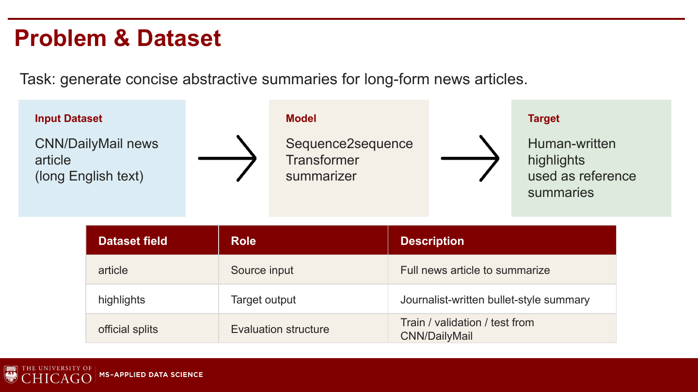

The central question is:

> How well does a fine-tuned BART summarization model perform on CNN/DailyMail, and how much do context limits and long-article truncation affect summary quality?

## 2. Why BART?

BART is a sequence-to-sequence Transformer model. It keeps the encoder-decoder structure that is natural for summarization: the encoder reads the article, and the decoder generates the summary.

BART is pretrained as a denoising autoencoder, meaning it learns to reconstruct clean text from corrupted text. This makes it a strong starting point for summarization, where the model must understand a long input and generate a shorter output.

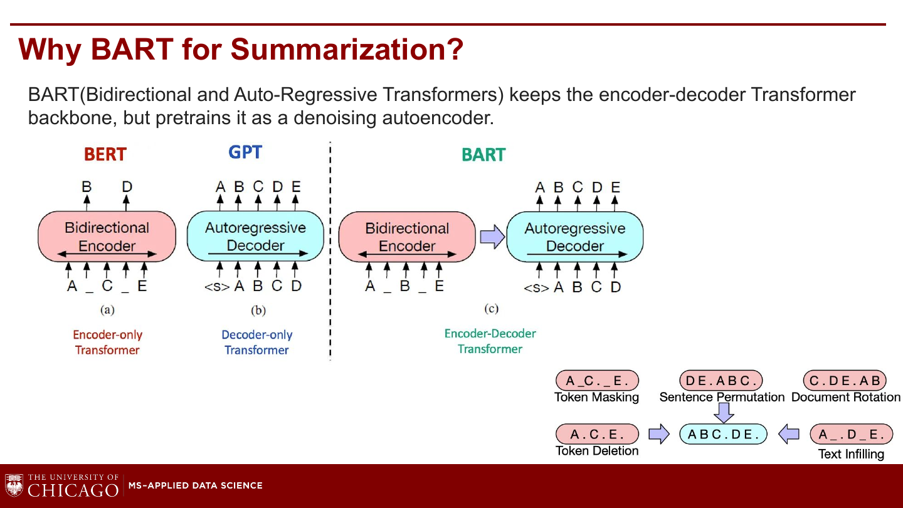

We use `facebook/bart-base` as the main model because it is large enough to be meaningful but still feasible to fine-tune in Colab.

## 3. Systems Compared

We compare our fine-tuned abstractive model against a simple extractive baseline and a stronger pretrained reference model.

| System | Type | Role in project |
| --- | --- | --- |
| Lead-3 | Extractive baseline | Uses the first three article sentences. Simple, but strong for news. |
| Fine-tuned BART-base | Our main model, about 140M parameters | BART-base trained by us on CNN/DailyMail subsets. |
| BART-large-CNN | Reference only, about 406M parameters | Already fine-tuned on CNN/DailyMail, so it is not counted as our main training result. |

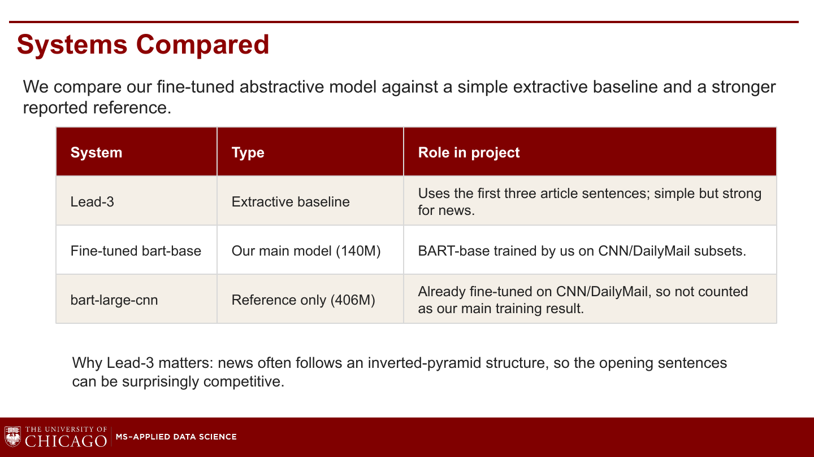

Lead-3 matters because many news articles follow an inverted-pyramid structure: the most important facts are often near the beginning.

## 4. Training Setup

Notebook 01 contains the main training and evaluation workflow.

| Choice | Setting used in our experiments |
| --- | --- |
| Main model | `facebook/bart-base` |
| Training sizes | 20k and 50k CNN/DailyMail training examples |
| Main reported run | 50k training examples |
| Validation subset | 1,500 examples |
| Test subset | 1,500 examples |
| Sequence lengths | 1024 input tokens, 128 target tokens |
| Hardware | Colab A100 GPU with BF16 mixed precision |
| Optimization | 2 epochs, learning rate `3e-5`, dynamic padding |
| Automatic metrics | ROUGE-1, ROUGE-2, ROUGE-L, ROUGE-Lsum, BERTScore |

Dynamic padding avoids wasting memory on shorter articles, while 1024 input tokens uses the maximum standard BART context window.

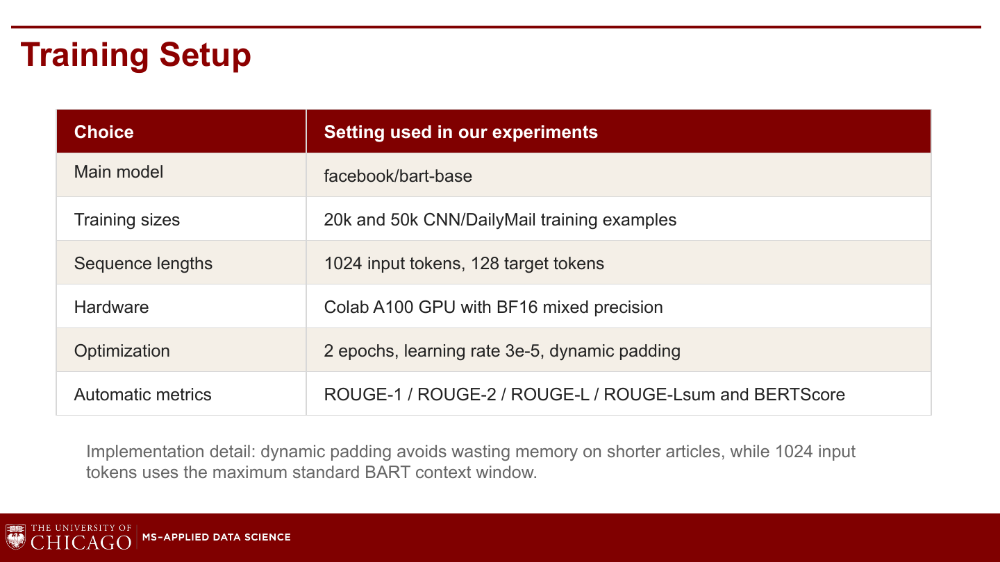

Dataset sizes after cleaning:

| Split | Examples |
| --- | ---: |
| Train | 287,111 |
| Validation | 13,368 |
| Test | 11,490 |

## 5. Main Evaluation Results

Fine-tuned BART-base improves over Lead-3. More training data helps, but the gain from 20k to 50k examples is modest.

| System | ROUGE-Lsum | BERTScore F1 |
| --- | ---: | ---: |
| Lead-3 baseline | 36.46 | 24.39 |
| BART-base 20k | 38.07 | 31.67 |
| BART-base 50k | 38.36 | 32.10 |
| BART-large-CNN reference | 40.04 | N/A |

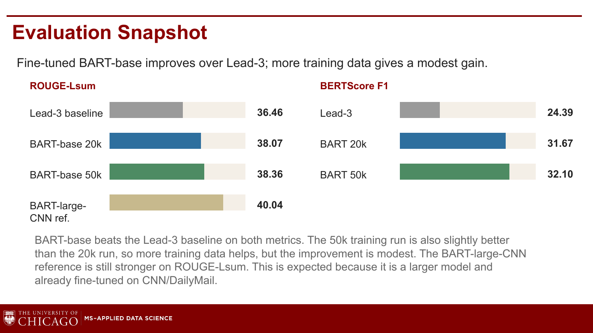

The more detailed 50k-run metric table from Notebook 01 is:

| Model | ROUGE-1 | ROUGE-2 | ROUGE-L | ROUGE-Lsum | BERTScore F1 |
| --- | ---: | ---: | ---: | ---: | ---: |
| Lead-3 extractive baseline | 40.1828 | 17.5035 | 24.9322 | 36.4560 | 24.3850 |
| Fine-tuned `facebook/bart-base` | 41.3973 | 18.7031 | 28.0295 | 38.3034 | 32.1985 |
| `facebook/bart-large-cnn` reported reference | 42.9490 | 20.8150 | 30.6190 | 40.0380 | N/A |

Main interpretation:

- Fine-tuning works: BART-base beats the Lead-3 baseline on both ROUGE and BERTScore.
- More data helps, but only modestly: the 50k run improves over the 20k run, but not dramatically.
- BART-large-CNN remains stronger because it is larger and already fine-tuned on CNN/DailyMail.

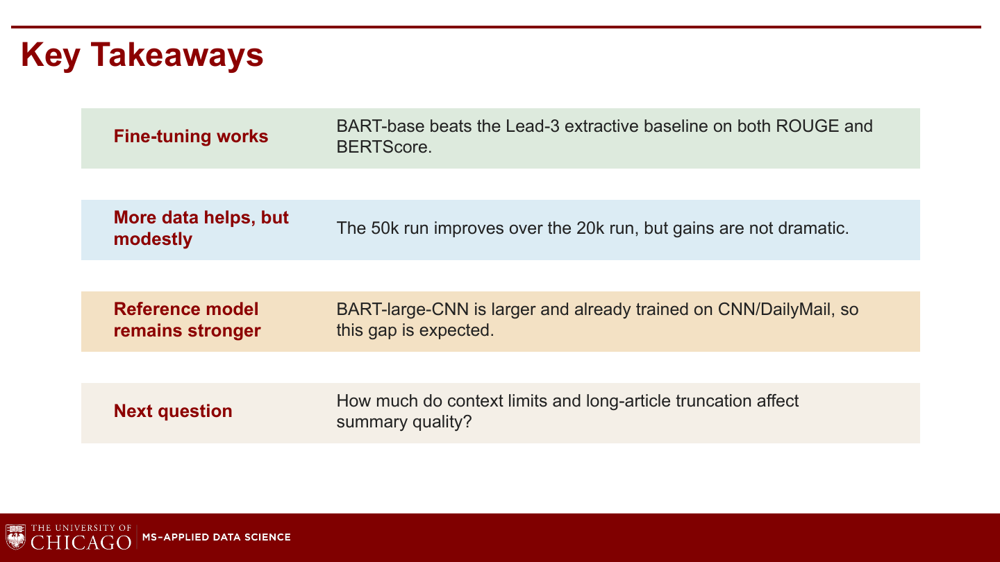

## 6. Truncation Problem

After the main experiment, the next question is whether context limits hurt summarization quality. Standard BART can only process up to 1024 input tokens, but many CNN/DailyMail articles are longer.

| Input limit | Cleaned training articles exceeding limit |
| ---: | ---: |
| 512 BART tokens | 79.54% |
| 1024 BART tokens | 30.04% |

Length distribution by split:

| Split | `<=512` | `513-1024` | `>1024` |
| --- | ---: | ---: | ---: |
| Train | 20.46% | 49.51% | 30.04% |
| Validation | 24.24% | 46.99% | 28.77% |
| Test | 23.74% | 47.04% | 29.22% |

This shows that 1024 tokens is much better than 512, but it still truncates about 30% of examples.

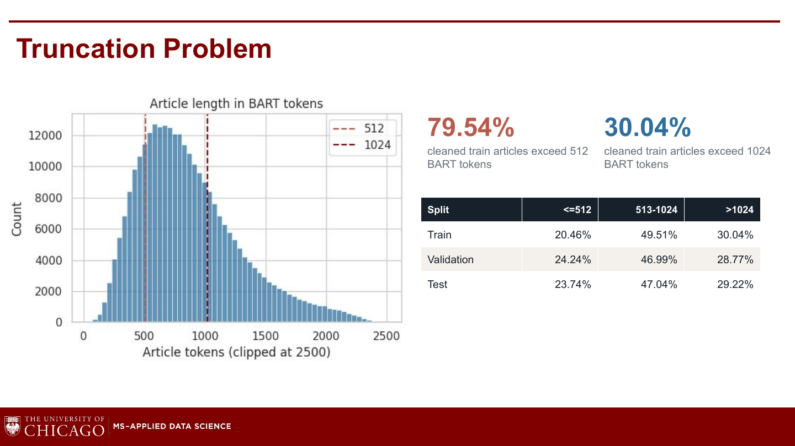

## 7. Article Length vs. Summary Quality

Summary quality decreases as article length increases. This suggests that long inputs are harder, although length alone does not prove that truncation is the only cause.

| Model | Length group | ROUGE-Lsum |
| --- | --- | ---: |
| Fine-tuned BART-base | `<=512` tokens | 41.13 |
| Lead-3 baseline | `<=512` tokens | 39.72 |
| Fine-tuned BART-base | `513-1024` tokens | 38.37 |
| Lead-3 baseline | `513-1024` tokens | 36.57 |
| Fine-tuned BART-base | `>1024` tokens | 35.73 |
| Lead-3 baseline | `>1024` tokens | 33.43 |

Both models score lower as articles move from short to long groups. However, longer articles may also be more complex, so we need additional analysis to separate input length from true truncation effects.

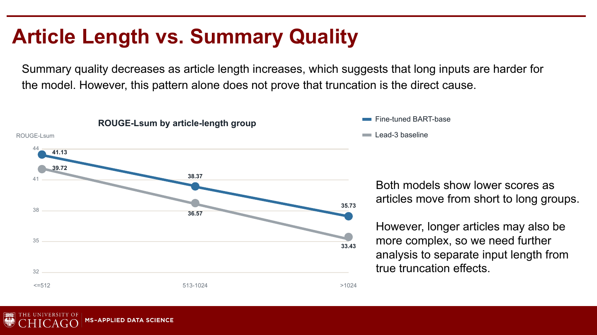

## 8. News Lead Bias

CNN/DailyMail articles often put the main event and key facts near the beginning. This is called the inverted-pyramid structure.

That structure matters for truncation. If the first 1024 tokens already contain most reference-relevant information, truncation may be less damaging than expected. If important facts appear only later in the article, truncation becomes more harmful.

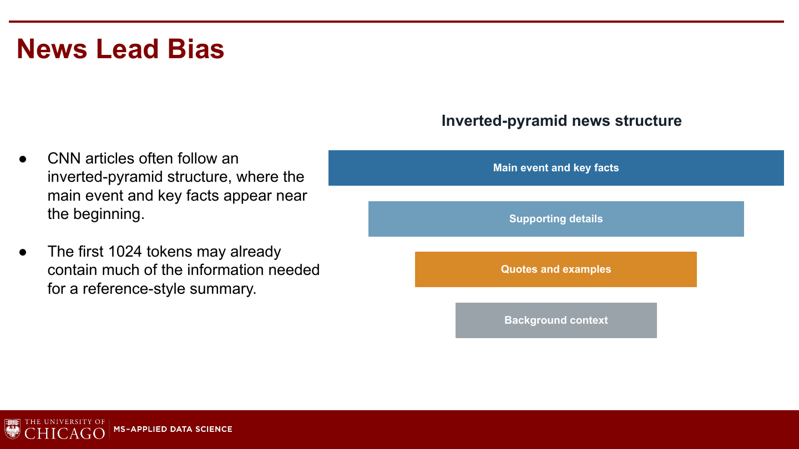

## 9. Reference Coverage Analysis

Notebook 02 checks whether reference-summary content appears in the first 1024 tokens or only in the article tail after the cutoff.

| Coverage measure | Mean | Median |
| --- | ---: | ---: |
| Prefix term coverage | 79.63% | 81.74% |
| Tail-only terms | 4.06% | 0.00% |
| Prefix entity coverage | 87.12% | 91.49% |
| Tail-only entities | 2.27% | 0.00% |

Interpretation: most reference-summary content is already covered by the first 1024 tokens. The tail adds some unique information, but tail-only reference terms and entities are relatively low.

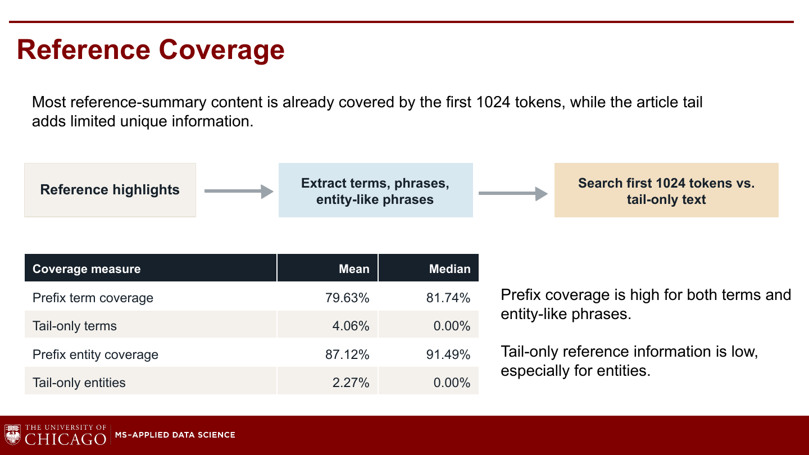

## 10. Long-Context Experiment Design

Notebook 02 evaluates all 440 test examples longer than 1024 BART tokens.

| Method | Design |
| --- | --- |
| Truncated BART | First 1024 tokens -> summary |
| Hierarchical BART | Article chunks -> chunk summaries -> final summary |
| Fine-tuned LED | Long-context encoder-decoder, up to 4096 tokens in this experiment |
| BART-large-CNN | Strong CNN/DailyMail reference model |

The goal is to test whether giving the model access to longer context improves performance over the simple 1024-token BART setup.

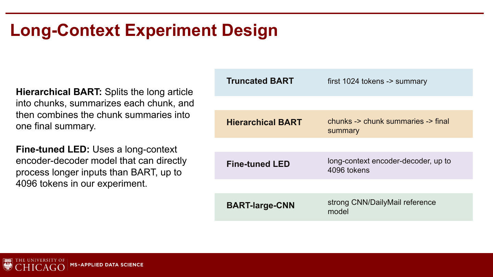

## 11. Long-Article Results

Longer context did not automatically improve performance.

| Method | ROUGE-Lsum | BERTScore F1 | Examples |
| --- | ---: | ---: | ---: |
| BART-large-CNN reference | 38.65 | 26.21 | 440 |
| Fine-tuned BART-base, 1024-token truncation | 35.73 | 27.44 | 440 |
| Hierarchical fine-tuned BART | 33.58 | 24.85 | 440 |
| Lead-3 baseline | 33.43 | 19.33 | 440 |
| Fine-tuned LED-base-16384 CNN/DM | 30.16 | 16.44 | 440 |

Main finding:

- BART-large-CNN is strongest on ROUGE-Lsum.
- Our fine-tuned BART-base with 1024-token truncation remains competitive.
- Hierarchical BART may lose details during chunk-level compression.
- LED has longer input access, but longer context alone is not enough; the model can still suffer from style mismatch or unstable generation.

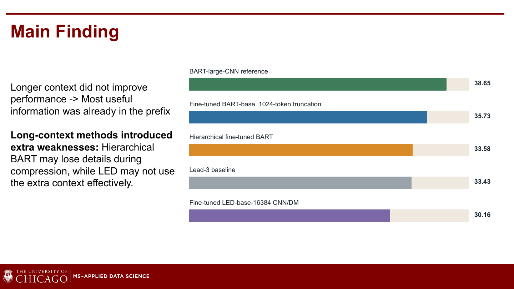

## 12. Qualitative Evaluation

Notebook 03 adds a structured qualitative evaluation because automatic metrics do not fully capture factual consistency, omissions, or usefulness.

Evaluation design:

| Item | Value |
| --- | ---: |
| Articles sampled | 30 |
| Methods per article | 5 |
| Total model outputs reviewed | 150 |
| Rubric scale | 1 to 5 |

Rubric dimensions:

- fluency,
- factual consistency,
- coverage,
- conciseness,
- primary error type.

Method-level qualitative scores:

| Method | Fluency | Factual | Coverage | Concise | Overall |
| --- | ---: | ---: | ---: | ---: | ---: |
| BART-large-CNN | 4.87 | 4.97 | 3.57 | 3.93 | 4.33 |
| Lead-3 | 4.80 | 5.00 | 2.50 | 3.40 | 3.93 |
| Fine-tuned BART | 4.37 | 4.77 | 2.80 | 3.37 | 3.83 |
| Hierarchical BART | 4.27 | 4.63 | 2.50 | 3.60 | 3.75 |
| LED | 3.20 | 3.80 | 2.27 | 3.03 | 3.08 |

Method-level error pattern:

- Lead-3 is very factually safe because it copies the opening, but it often misses reference-relevant details later in the article.
- Fine-tuned BART improves coverage over Lead-3, but still loses points for omissions and occasional unsupported or verbose details.
- Hierarchical BART accesses more text, yet chunk-level compression does not translate into better coverage or overall quality.
- LED has longer input access, but lower factual and fluency scores suggest style mismatch and less stable generation in this setup.

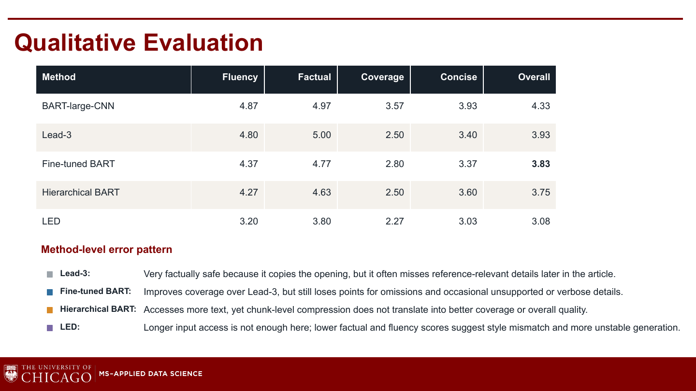

## 13. Real-News Demo

Notebook 04 demonstrates the trained model on a recent article outside CNN/DailyMail. Since the article has no human reference summary, we do not compute ROUGE or BERTScore. The output is judged qualitatively for readability, coverage, and factual consistency.

Example generated summary from the demo:

> SpaceX's regulatory filing revealed a financially smart link between its launch-services division and profitable Starlink satellite internet operation. Its AI business looks shakier than its rockets. Revenue in the AI division has mostly come from X, which is not a pure-play AI venture.

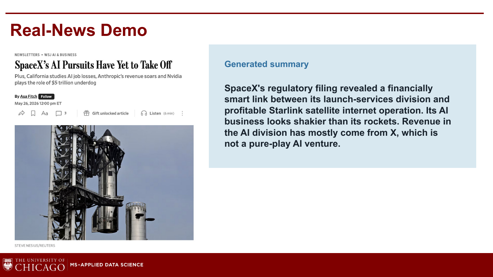

## 14. Final Takeaways

1. Fine-tuning BART-base improves over a simple but strong Lead-3 baseline.
2. Increasing training data from 20k to 50k examples helps, but the improvement is modest.
3. Context length matters: about 30% of cleaned training articles exceed 1024 BART tokens.
4. News lead bias reduces the damage of truncation because many key facts appear early.
5. Longer-context methods are not automatically better; hierarchical compression and LED generation both introduced weaknesses in this experiment.
6. Qualitative evaluation is necessary because ROUGE and BERTScore do not fully capture factuality, omissions, or summary usefulness.

## 15. Notebook Workflow

Run the notebooks in order if reproducing from scratch:

1. `01_main_bart_cnn_dailymail_experiment.ipynb`
2. `02_hierarchical_long_context_experiments.ipynb`
3. `03_factual_consistency_and_rubric.ipynb`
4. `04_recent_news_demo.ipynb`

For review, re-running is not required. The notebooks already include executed outputs and show the full workflow.

## 16. Setup

Install the main Python dependencies:

```bash
pip install -r requirements.txt
```

Some cells assume Colab paths such as `/content/drive/MyDrive/...`. If running locally, update the storage paths and reduce batch sizes if GPU memory is limited.
